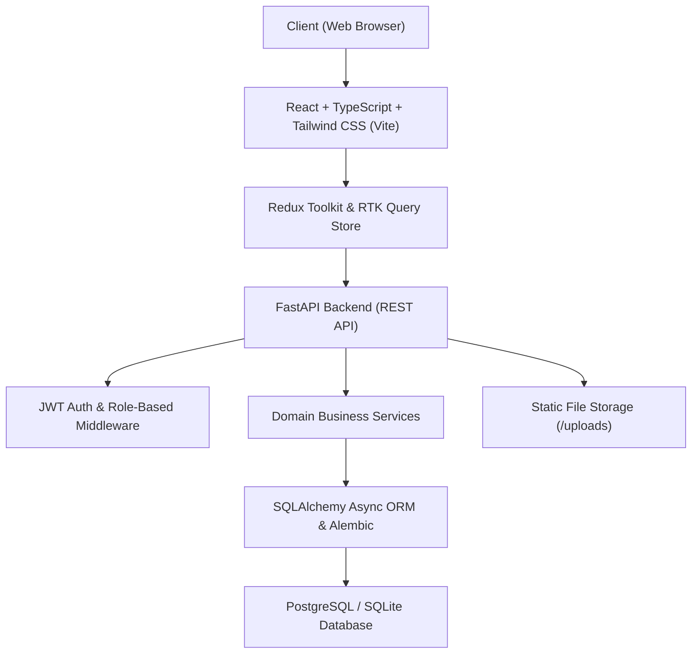

# SuperTime — Timesheet & Resource Governance Platform
## System Overview & Purpose Documentation

---

## 1. Executive Summary & Purpose

**SuperTime** is an enterprise-grade **Timesheet, Resource Allocation, and Project Governance Platform** designed for software development, IT services, and professional consulting organizations.

### Core Purpose:
1. **Accurate Time Tracking & Labor Accounting**: Seamless tracking of billable and non-billable employee hours across multiple clients and projects with approval workflows.
2. **Resource & Tool Governance**: Centralized management of human capital (software engineers, designers, managers) and digital capital (software licenses, AI APIs, cloud infrastructure, SaaS tools) allocated to client projects.
3. **Financial & Cost Visibility**: Real-time project cost analytics, budget burn rates, earned value tracking, CPI (Cost Performance Index), profit margins, and seat-level tool cost allocation.
4. **Leave & Overtime Management**: Integrated leave requests (full day, half day, partial hour passes), organization holiday calendars, compensatory offs, and weekend overtime approvals.
5. **Role-Based Access Control (RBAC)**: Strict segregation of duties across **Employees**, **Project Managers (PM)**, **Account Managers (AM)**, and **System Administrators**.

---

## 2. Architecture & Tech Stack

### Backend:
- **Framework**: FastAPI (Python 3.10+) with async endpoints.
- **ORM & Database**: SQLAlchemy (Async Engine) with PostgreSQL / SQLite.
- **Database Migrations**: Alembic (Consolidated versioning).
- **Authentication**: JWT token with refresh mechanism, bcrypt password hashing, and role dependencies.
- **File Management**: Multipart document uploads for project specifications, contracts, and supporting assets.

### Frontend:
- **Framework**: React 18 with TypeScript.
- **State Management**: Redux Toolkit (RTK Query) with optimistic UI updates and cache invalidation tags.
- **Styling**: Tailwind CSS with rich glassmorphic palettes, badges, and responsive views.
- **Icons**: Lucide React icons.

---

## 3. Four Role Portals & Current Functionality

---

### Portal 1: Employee Portal (`/portal=employee`)

Dedicated workspace for developers, designers, and team members:

1. **My Dashboard**:
   - Weekly logged hours vs target working hours.
   - Project distribution breakdown (billable vs non-billable ratio).
   - Upcoming organization holidays and leave status badges.
2. **Submit Daily Timesheet**:
   - Submit daily hours per assigned project.
   - Granular separation of **Billable Hours & Summary** vs **Non-Billable Hours & Summary**.
   - Inline "Mark Leave" trigger if taking time off instead of working.
3. **Timesheets History**:
   - Multi-view timesheet explorer: Interactive Calendar View and Detailed List View.
   - Status indicators (`Submitted`, `Approved`, `Rejected`) with PM review comments.
4. **My Assigned Projects**:
   - Overview of active project assignments, PM contact, and client information.
   - **Project Details Modal**: Project objectives, assigned team members, software licenses/tools allocated, and **Supporting Documents** (direct download/preview).
5. **Leave Management**:
   - Leave balance meters (Annual Leave, Sick Leave, Parental, Comp-Off).
   - Apply for leave with flexible durations: Full Day, Half Day (Morning/Afternoon), or Partial Day (e.g. 2-hour medical/personal passes).
6. **Weekend Work Requests**:
   - Submit planned weekend overtime with expected hours and technical justifications.
   - Track approval status by Project Manager.

---

### Portal 2: Project Manager (PM) Portal (`/portal=pm`)

Operational hub for Project Managers to manage delivery, teams, and software tooling:

1. **PM Dashboard**:
   - High-level KPIs: Active projects, total team members, pending timesheet reviews, and weekend overtime requests.
2. **My Projects (Dedicated Full-Page & Tabbed Views)**:
   - Project CRUD (Create, Edit, Active/Inactive state management).
   - Client selection and budget/timeline configuration.
   - **Supporting Documents Management**: Upload and manage project files (contracts, SRS, wireframes, technical specs) with direct download capabilities.
   - **Milestone Tracking**: Create and track milestones with percentage weights, completion status, and delivery deadlines.
   - **Project Team**: Assign/remove employees from project rosters.
3. **Resource & Tool Allocation**:
   - **Employee Assignments**: Assign engineers to projects with availability checks (highlighting if an employee is currently on leave).
   - **Software Tool Allocation**:
     - Select from the **Master Tool Catalog** configured by Admin.
     - Configure **Monthly Rate ($/mo)**, **Seats/Quantity Allotted**, **Start Date**, and **End Date**.
     - Live calculation of total monthly tool spend (`Seats × Rate`).
     - One-click tool deallocation.
4. **Timesheet Review**:
   - Review submitted team timesheets with billable/non-billable notes.
   - One-click **Approve** or **Reject** (with mandatory feedback comment).
5. **Weekend Work Approvals**:
   - Review and approve/reject weekend overtime submissions.

---

### Portal 3: Account Manager Portal (`/portal=ac_manager`)

Financial governance and portfolio oversight:

1. **Portfolio Overview**:
   - Aggregated revenue, gross cost, overall profit margins, and project health distribution.
2. **Project Financials (EV / Budget vs Actual)**:
   - Earned Value (EV), Actual Cost (AC), Planned Budget.
   - CPI (Cost Performance Index) and Cost Variance analytics.
3. **Tool Utilization & Cloud Spend**:
   - Breakdown of software licenses, AI tokens, and cloud server expenses across all client accounts.
4. **Account Reports**:
   - Exportable financial and billability audit summaries.

---

### Portal 4: Administrator Portal (`/portal=admin`)

Master organizational governance and global configuration:

1. **Master Dashboard**:
   - System-wide user statistics, active assignments, and system health.
2. **User Management**:
   - Create, edit, and deactivate user accounts.
   - Assign roles: `Admin`, `Project_Manager`, `Account_Manager`, `Employee`.
   - Manage job titles, departments, and employee IDs.
3. **Master Tool Catalog Management (`ToolsManagement.tsx`)**:
   - Configure company-wide software tools and subscriptions (e.g. OpenAI, AWS, Figma, GitHub, Jira).
   - Categorize by `AI`, `Cloud`, `Dev`, `Design`, `SaaS`, `Testing`, `Security`, etc.
   - Toggle tools `Active` / `Inactive` (Inactive tools cannot be allocated by PMs).
4. **Leave Types Management & Entitlement Rules**:
   - Create and edit leave policies (Annual Leave, Sick Leave, Maternity/Paternity, Comp-Off, Partial Day).
   - One-click **Activate / Deactivate** policy toggling.
5. **Organization Holidays Management**:
   - Add national and corporate holidays with dates, names, and optional working status.
6. **Working Calendar Configuration**:
   - Set standard working hours per full day (e.g. 8.0 hrs), half-day hours (4.0 hrs), partial-day thresholds (min 1 hr, max 3 hrs), active working days (Mon–Fri), and organizational timezones.

---

## 4. Key Data Entities & Relationships

| Entity | Description | Key Relationships |
|---|---|---|
| **User** | Employee / Manager account with role & credentials | Assigned to Projects, Timesheets, Leaves, Approvals |
| **Client** | External corporate client | Owns Projects |
| **Project** | Client deliverable project | PM (User), Client, Assignments, Tools, Milestones, Docs |
| **ProjectAssignment** | Active association between User & Project | Links User to Timesheets and Weekend Work |
| **Tool** | Master software/cloud catalog item (Admin) | Has multiple project ToolAllocations |
| **ToolAllocation** | Tool assigned to a Project with seats & monthly cost | Belongs to Project and Tool |
| **ProjectDocument** | Uploaded file attached to a project | Belongs to Project |
| **Timesheet** | Daily log of billable & non-billable hours | Belongs to User and ProjectAssignment |
| **LeaveRequest** | Full-day, half-day, or partial-day time off | Belongs to User and LeaveType; reviewed by Manager |
| **LeaveType** | Configured leave category with rules (Admin) | Categorizes LeaveRequests and LeaveBalances |
| **WeekendWorkRequest** | Overtime planned on weekends | Belongs to User and Project; approved by PM |
| **Holiday** | Company holiday calendar entry | Organization-wide reference |
| **WorkingCalendar** | Working hour thresholds & working days config | Organization-wide reference |

---

## 5. Security & Governance Highlights
- **Role Enforcement at API & UI Layers**: Endpoints use FastAPI dependency injection (`require_roles(...)` / `require_admin`) ensuring unauthorized actors cannot modify master data or approve their own requests.
- **Audit Logging**: System tracks creation and modification timestamps, reviewer IDs, and rejection reasons across timesheets and leaves.
- **Soft Deletions**: Projects, leave types, and tool allocations support active/inactive states rather than hard deletes, preserving historic reporting integrity.
